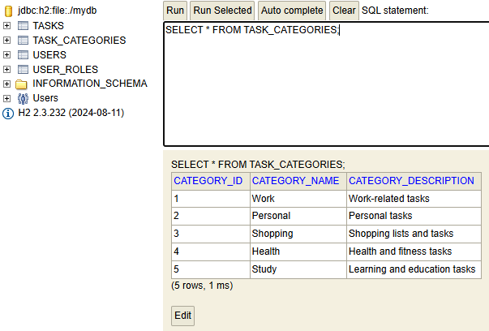

# Todo Application REST API

## Description

A Spring Boot-based REST API that enables users to manage their todos with category organization. The application implements role-based access control where users can only access their own todos unless they have admin privileges.

## Features

- CRUD operations for todos and categories
- Advanced search functionality (by user, name, description, deadline, category)
- Role-based access control (User/Admin roles)
- Basic authentication
- H2 database for data persistence
- OpenAPI documentation (Swagger)

## Project Structure

```
todo-app/
├── src/
│   ├── main/
│   │   ├── java/ch/cern/todo/
│   │   │   ├── config/ - Configuration classes
│   │   │   │   ├── OpenApiConfig.java - Swagger documentation config
│   │   │   │   └── SecurityConfig.java - Security configuration
│   │   │   ├── controller/ - REST controllers
│   │   │   │   ├── TaskController.java - Task endpoints
│   │   │   │   └── TaskCategoryController.java - Category endpoints
│   │   │   ├── dto/ - Data Transfer Objects
│   │   │   │   ├── CategoryDTO.java - Category data transfer
│   │   │   │   └── TaskDTO.java - Task data transfer
│   │   │   ├── exception/ - Custom exceptions
│   │   │   │   └── ResourceNotFoundException.java
│   │   │   ├── model/ - Entity classes
│   │   │   │   ├── Task.java - Task entity
│   │   │   │   ├── TaskCategory.java - Category entity
│   │   │   │   └── User.java - User entity
│   │   │   ├── repository/ - Data access layer
│   │   │   │   ├── TaskRepository.java - Task database operations
│   │   │   │   ├── TaskCategoryRepository.java - Category database operations
│   │   │   │   └── UserRepository.java - User database operations
│   │   │   ├── service/ - Business logic layer
│   │   │   │   ├── TaskService.java - Task business logic
│   │   │   │   ├── TaskCategoryService.java - Category business logic
│   │   │   │   └── UserService.java - User business logic
│   │   │   └── TodoApplication.java - Application entry point
│   │   └── resources/
│   │       └── application.properties - Application configuration
│   └── test/ - Test classes
└── pom.xml - Project dependencies
```

## Technical Stack

- Java 21
- Spring Boot 3.4.1
- Spring Security
- Spring Data JPA
- H2 Database
- JUnit 5 & Spring Test

## Prerequisites

- Java 21 or higher
- Gradle 8.5 or higher
- Git (optional)

## Setup and Installation

1. Clone the repository:
```bash
git clone https://github.com/CH6832/todo-web-app-solution.git
```

2. Navigate to project directory:
```bash
cd todo-web-app-solution
```

3. Build the project:
```bash
./gradlew build
```

4. Run the application:
```bash
./gradlew bootRun
```

## Database Configuration

```properties
# Database Configuration
# ---------------------------------------------
# H2 Database connection settings
spring.datasource.url=jdbc:h2:mem:testdb;DB_CLOSE_DELAY=-1;DB_CLOSE_ON_EXIT=FALSE
spring.datasource.driverClassName=org.h2.Driver
spring.datasource.username=sa
spring.datasource.password=password

# JPA/Hibernate Configuration
# ---------------------------------------------
# Hibernate dialect and DDL settings
spring.jpa.database-platform=org.hibernate.dialect.H2Dialect
spring.jpa.hibernate.ddl-auto=create-drop

# SQL logging and formatting
spring.jpa.show-sql=true
spring.jpa.properties.hibernate.format_sql=true

# Data initialization
spring.sql.init.mode=always
spring.jpa.defer-datasource-initialization=true

# H2 Console Configuration
# ---------------------------------------------
# Enable H2 database web console
spring.h2.console.enabled=true
spring.h2.console.path=/h2-console
```

## Architecture

The application follows a layered architecture:
1. Controller Layer (REST API endpoints)
2. Service Layer (Business logic)
3. Repository Layer (Data access)
4. Database Layer (H2 database)

## API Endpoints

### Tasks

- POST /api/tasks - Create new task
- GET /api/tasks/{id} - Get task by ID
- PUT /api/tasks/{id} - Update task
- DELETE /api/tasks/{id} - Delete task
- GET /api/tasks/search - Search tasks with filters

### Categories

- POST /api/categories - Create new category (Admin only)
- GET /api/categories/{id} - Get category by ID
- PUT /api/categories/{id} - Update category (Admin only)
- DELETE /api/categories/{id} - Delete category (Admin only)
- GET /api/categories - Get all categories

## API Testing

### 1. Create Admin User

```powershell
# Create admin user
$adminCreds = @{
    username = "admin"
    password = "adminpass"
    roles = @("ROLE_ADMIN")
} | ConvertTo-Json

Invoke-RestMethod -Uri "http://localhost:8080/api/users" -Method Post -Body $adminCreds -ContentType "application/json"
```

### 2. Create Regular User

```powershell
# Create regular user
$userCreds = @{
    username = "user1"
    password = "pass123"
    roles = @("ROLE_USER")
} | ConvertTo-Json

Invoke-RestMethod -Uri "http://localhost:8080/api/users" -Method Post -Body $userCreds -ContentType "application/json"
```

### 3. Create Category (Admin only)

```powershell
# Create category as admin
$category = @{
    categoryName = "Work"
    categoryDescription = "Work related tasks"
} | ConvertTo-Json

$result = Invoke-RestMethod -Uri "http://localhost:8080/api/categories" `
    -Method Post -Body $category -ContentType "application/json" `
    -Headers @{Authorization = "Basic "+[Convert]::ToBase64String([Text.Encoding]::ASCII.GetBytes("admin:adminpass"))}

Write-Output $result
```

Output:
```json
{
    "categoryId": 1,
    "categoryName": "Work",
    "categoryDescription": "Work related tasks"
}
```

### 4. Create Task

```powershell
# Create task as user1
$task = @{
    taskName = "Complete project"
    taskDescription = "Finish the TODO application"
    deadline = "2024-02-01T12:00:00"
    categoryId = 1
} | ConvertTo-Json

$result = Invoke-RestMethod -Uri "http://localhost:8080/api/tasks" `
    -Method Post -Body $task -ContentType "application/json" `
    -Headers @{Authorization = "Basic "+[Convert]::ToBase64String([Text.Encoding]::ASCII.GetBytes("user1:pass123"))}

Write-Output $result
```

Output:
```json
{
    "taskId": 1,
    "taskName": "Complete project",
    "taskDescription": "Finish the TODO application",
    "deadline": "2024-02-01T12:00:00",
    "category": {
        "categoryId": 1,
        "categoryName": "Work"
    }
}
```

### 5. Search Tasks

```powershell
# Search tasks with multiple criteria
$result = Invoke-RestMethod -Uri "http://localhost:8080/api/tasks/search?username=user1&name=project&deadline=2024-02-01" `
    -Method Get `
    -Headers @{Authorization = "Basic "+[Convert]::ToBase64String([Text.Encoding]::ASCII.GetBytes("user1:pass123"))}

Write-Output $result
```

Output:
```json
[
    {
        "taskId": 1,
        "taskName": "Complete project",
        "deadline": "2024-02-01T12:00:00"
    }
]
```

### 6. Security Test

```powershell
# Try to access user1's task as user2 (should fail)
try {
    $result = Invoke-RestMethod -Uri "http://localhost:8080/api/tasks/1" `
        -Method Get `
        -Headers @{Authorization = "Basic "+[Convert]::ToBase64String([Text.Encoding]::ASCII.GetBytes("user2:pass123"))}
} catch {
    Write-Output $_.Exception.Response.StatusCode.value__
}
```

Output:
```
403
```

### 7. Admin Role Tests

```powershell
# Test 7.1: Regular user trying to create category (should fail)
try {
    $category = @{
        categoryName = "Failed Category"
        categoryDescription = "This should fail"
    } | ConvertTo-Json

    $result = Invoke-RestMethod -Uri "http://localhost:8080/api/categories" `
        -Method Post -Body $category -ContentType "application/json" `
        -Headers @{Authorization = "Basic "+[Convert]::ToBase64String([Text.Encoding]::ASCII.GetBytes("user1:pass123"))}
} catch {
    Write-Output "Regular user create category status code: $($_.Exception.Response.StatusCode.value__)"
}
```

Output:
```
Regular user create category status code: 403
```

```powershell
# Test 7.2: Admin accessing any user's task (should succeed)
$result = Invoke-RestMethod -Uri "http://localhost:8080/api/tasks/1" `
    -Method Get `
    -Headers @{Authorization = "Basic "+[Convert]::ToBase64String([Text.Encoding]::ASCII.GetBytes("admin:adminpass"))}

Write-Output "Admin accessing user's task:"
Write-Output $result
```

Output:
```json
{
    "taskId": 1,
    "taskName": "Complete project",
    "taskDescription": "Finish the TODO application",
    "deadline": "2024-02-01T12:00:00",
    "category": {
        "categoryId": 1,
        "categoryName": "Work"
    }
}
```

```powershell
# Test 7.3: Admin updating category (should succeed)
$updatedCategory = @{
    categoryName = "Updated Work"
    categoryDescription = "Updated work tasks"
} | ConvertTo-Json

$result = Invoke-RestMethod -Uri "http://localhost:8080/api/categories/1" `
    -Method Put -Body $updatedCategory -ContentType "application/json" `
    -Headers @{Authorization = "Basic "+[Convert]::ToBase64String([Text.Encoding]::ASCII.GetBytes("admin:adminpass"))}

Write-Output "Admin updating category:"
Write-Output $result
```

Output:
```json
{
    "categoryId": 1,
    "categoryName": "Updated Work",
    "categoryDescription": "Updated work tasks"
}
```

```powershell
# Test 7.4: Regular user trying to delete category (should fail)
try {
    $result = Invoke-RestMethod -Uri "http://localhost:8080/api/categories/1" `
        -Method Delete `
        -Headers @{Authorization = "Basic "+[Convert]::ToBase64String([Text.Encoding]::ASCII.GetBytes("user1:pass123"))}
} catch {
    Write-Output "Regular user delete category status code: $($_.Exception.Response.StatusCode.value__)"
}
```

Output:
```
Regular user delete category status code: 403
```

```powershell
# Test 7.5: Admin deleting category (should succeed)
$result = Invoke-RestMethod -Uri "http://localhost:8080/api/categories/1" `
    -Method Delete `
    -Headers @{Authorization = "Basic "+[Convert]::ToBase64String([Text.Encoding]::ASCII.GetBytes("admin:adminpass"))}

Write-Output "Admin delete category status code: 204"
```

### Summary of Admin Role Tests:

1. Regular users cannot create categories (403 Forbidden)
2. Admin can access any user's tasks
3. Admin can update categories
4. Regular users cannot delete categories (403 Forbidden)
5. Admin can delete categories

These tests verify that:
- Admin has full access to all tasks and categories
- Regular users are restricted from category management
- Admin role permissions are properly enforced
- Authentication is working correctly for both admin and regular users

### Database Verification

```sql
-- Verify users
SELECT * FROM USERS;
```


```sql
SELECT * FROM USER_ROLES;
```


```sql
-- Verify categories
SELECT * FROM TASK_CATEGORIES;
```




```sql
-- Verify tasks
SELECT t.TASK_ID, t.TASK_NAME, t.DEADLINE, 
       u.USERNAME, c.CATEGORY_NAME
FROM TASKS t
JOIN USERS u ON t.USER_ID = u.ID
JOIN TASK_CATEGORIES c ON t.CATEGORY_ID = c.CATEGORY_ID;
```


## Error Handling

The API uses standard HTTP status codes:
- 200: Success
- 201: Created
- 400: Bad Request
- 401: Unauthorized
- 403: Forbidden
- 404: Not Found
- 500: Internal Server Error

Example error response:
```json
{
    "status": 404,
    "message": "Task not found with id: 123",
    "timestamp": "2024-01-25T10:30:15"
}
```

## Testing

### Unit Tests

Run unit tests:
```bash
./gradlew test
```

### Integration Tests

Run integration tests:
```bash
./gradlew integrationTest
```

### Test Coverage

Add to build.gradle:
```gradle
plugins {
    id 'jacoco'
}

test {
    finalizedBy jacocoTestReport
}

jacocoTestReport {
    dependsOn test
    reports {
        xml.required = false
        csv.required = false
        html.outputLocation = layout.buildDirectory.dir('jacocoHtml')
    }
}
```

Generate test coverage report:
```bash
./gradlew jacocoTestReport
```
Coverage report will be available in build/jacocoHtml/index.html

### Running Specific Tests

```bash
# Run a specific test class
./gradlew test --tests "ch.cern.todo.TaskControllerTest"

# Run a specific test method
./gradlew test --tests "ch.cern.todo.TaskControllerTest.createTask_ShouldSucceed"
```

### Debugging Tests

Add to build.gradle:
```gradle
test {
    testLogging {
        events "passed", "skipped", "failed"
        exceptionFormat "full"
    }
}
```

## Future Improvements

1. Add task status (PENDING, IN_PROGRESS, COMPLETED)
2. Add task priority levels
3. Implement pagination for search results
4. Add due date notifications
5. Add task comments/attachments
6. Implement JWT authentication
7. Add task sharing between users
8. Add task tags
9. Add task completion history
10. Implement task export functionality
